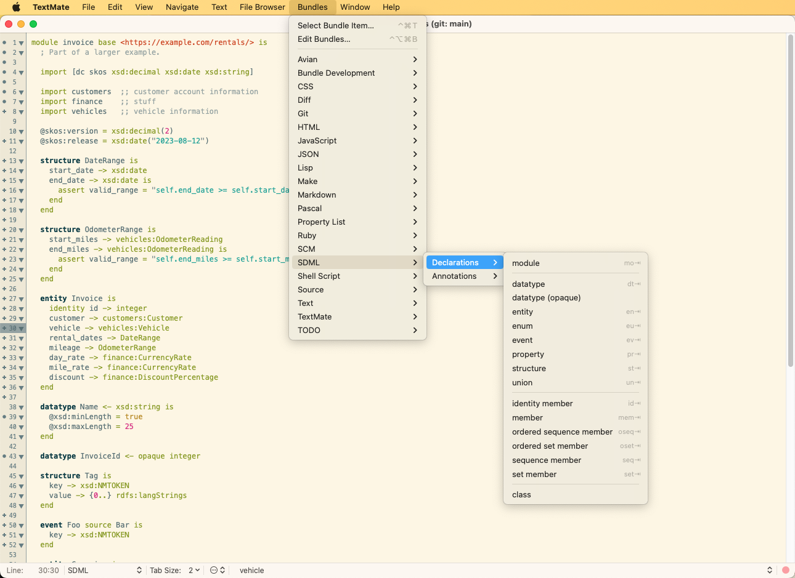
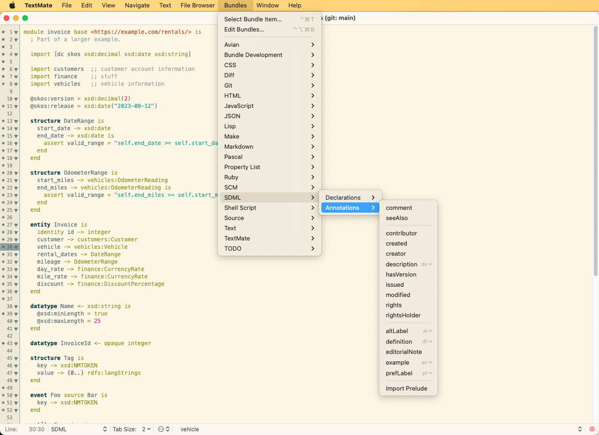
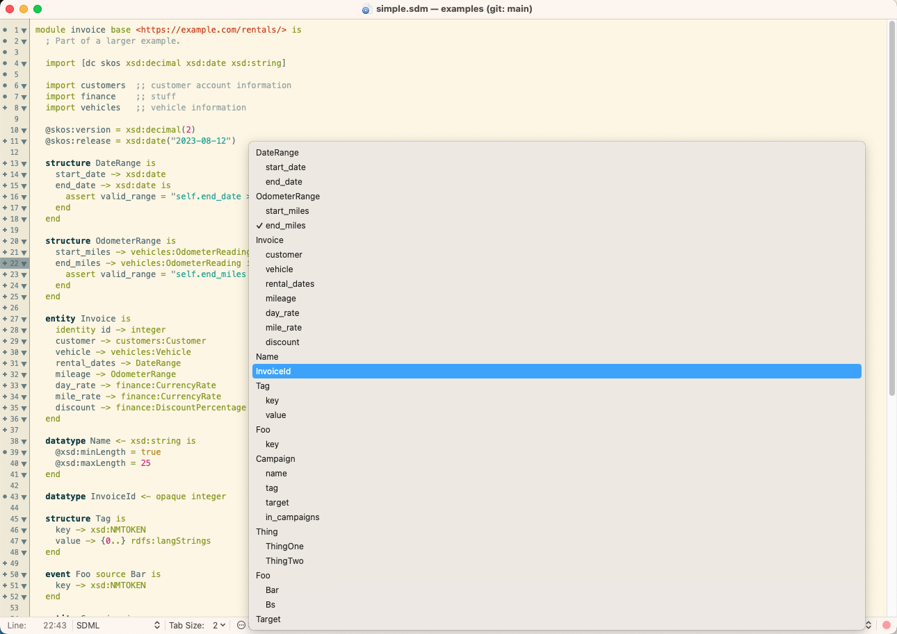

# SDML Bundle for TextMate

```
        ___          _____          ___
       /  /\        /  /::\        /__/\
      /  /:/_      /  /:/\:\      |  |::\
     /  /:/ /\    /  /:/  \:\     |  |:|:\    ___     ___
    /  /:/ /::\  /__/:/ \__\:|  __|__|:|\:\  /__/\   /  /\
   /__/:/ /:/\:\ \  \:\ /  /:/ /__/::::| \:\ \  \:\ /  /:/
   \  \:\/:/~/:/  \  \:\  /:/  \  \:\~~\__\/  \  \:\  /:/
    \  \::/ /:/    \  \:\/:/    \  \:\         \  \:\/:/
     \__\/ /:/      \  \::/      \  \:\         \  \::/
       /__/:/        \__\/        \  \:\         \__\/
       \__\/          Domain       \__\/          Language
        Simple                      Modeling
```

This [TextMate](https://macromates.com/) bundle contains a language grammar and settings for editing [Simple Domain Modeling Language](sdml.io) (SDML) files. 

A Github workflow attaches a downloadable `.tmbundle` zip file to each [release](https://github.com/sdm-lang/SDML.tmbundle/releases/).

## Features

1. Syntax highlighting based on a *tmlanguage* grammar.
2. Declarations added to the window's Symbol List.
3. Declaration and Annotation snippets.
4. (Experimental) command-line integration for diagram generation.

## Installation

TextMate, and most editors that support TextMate bundles, allow the installation of bundles simply by extracting an archive or cloning the repository into the application's bundle directory. This bundle is no different.

For TextMate, the easiest approach is the install shell script shown below. This will create a new folder in TextMate's bundle folder and clone the Github repository locally. 

```bash
$ curl https://raw.githubusercontent.com/sdm-lang/SDML.tmbundle/main/install.sh | sh
```

Alternatively, you can download a release zip file from Github and unzip on the TextMate bundle directory.

### Intellij IDEA

JetBrains tools such as IntelliJ IDEA have instructions https://www.jetbrains.com/help/idea/textmate.html. 

## Screenshots

The SDML bundle menu allows for the insertion of various language declarations, many of them with tab shortcuts. For example `dt` followed by the tab key will expand to a datatype declaration.



Similarly a number of useful annotations can be inserted.



Finally, note that the symbol list (bottom of the editor window) shows the structure of the module with types, members and variants.



## TODO

- The grammar is relatively complete with the exception of formal constraints.
- Currently no interaction with the `sdml` command-line tool.
